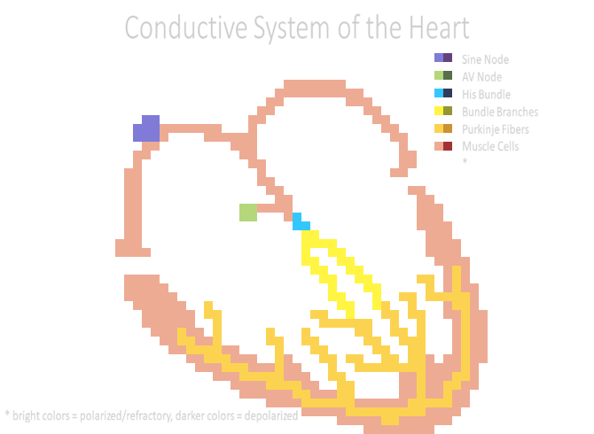

# BI-CellularAutomaton
A graphical model for the excitation propagation at the myocardium,
implemented as a Cellular Automaton in Python.

  

Written by Anna Friedl, Kerstin Pegler and Ingo Weigel.

May 13th, 2020

Find this project on GitHub: https://github.com/shishakohle/BI-CellularAutomaton

This project was carried out in the "Bioinformatics" course at
University of Applied Sciences Technikum Wien (Vienna, Austria)
under the guidance of lecturer Mariia Gonta.
